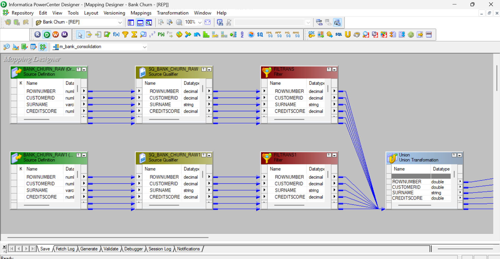
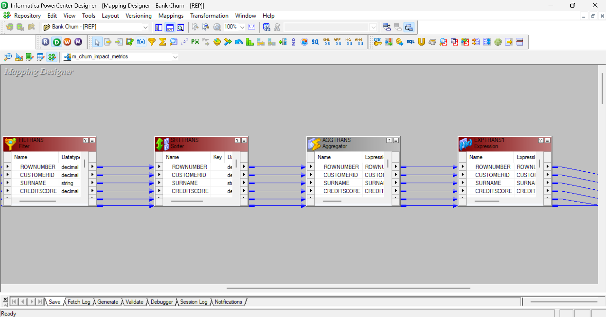
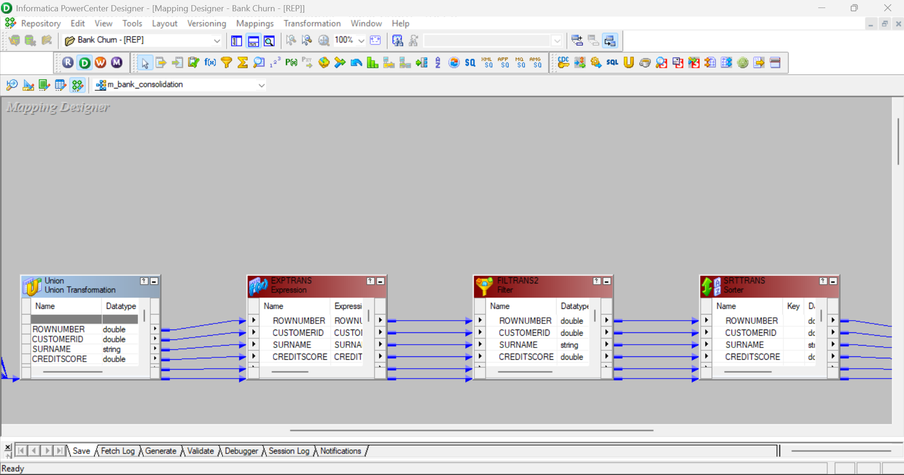
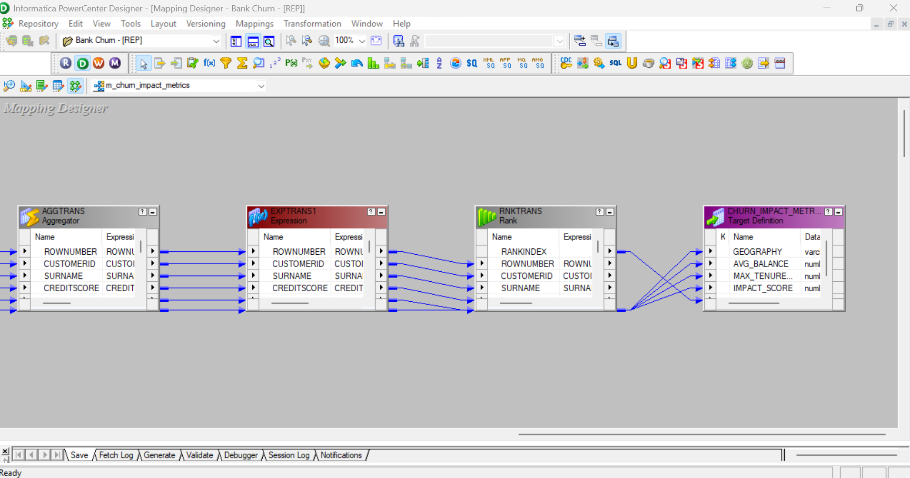
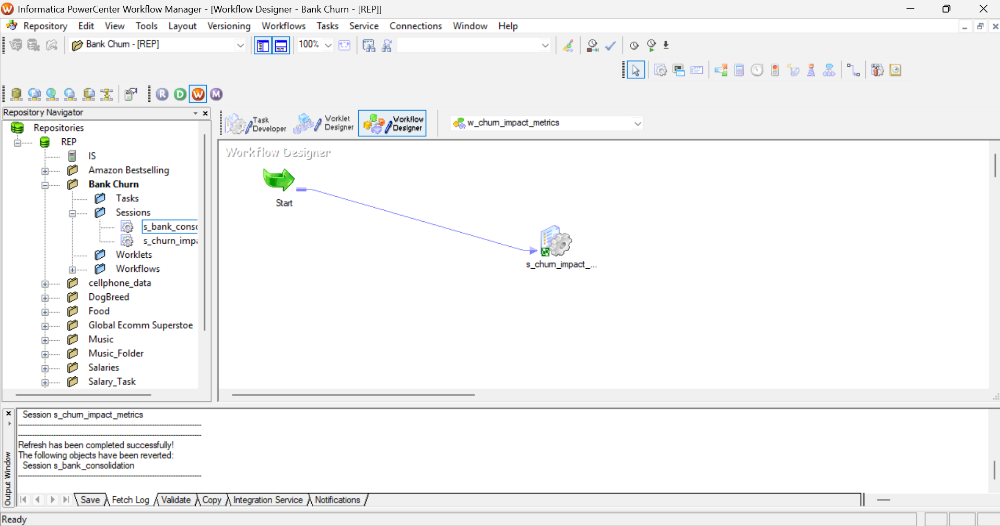
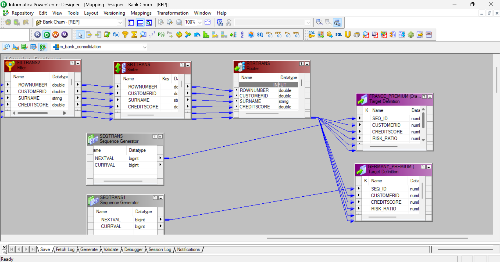
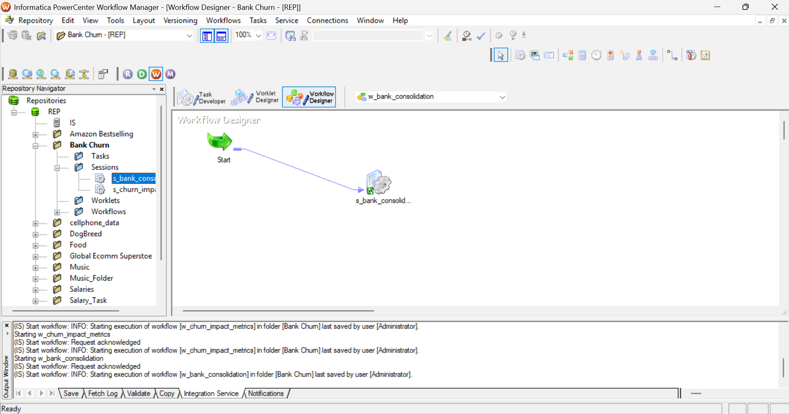
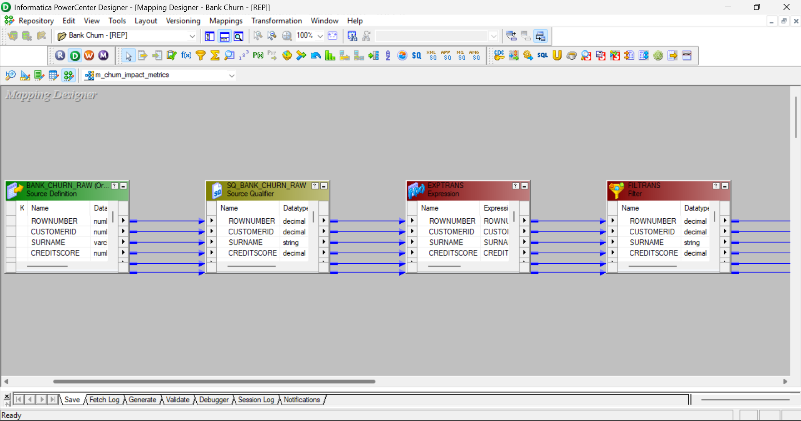
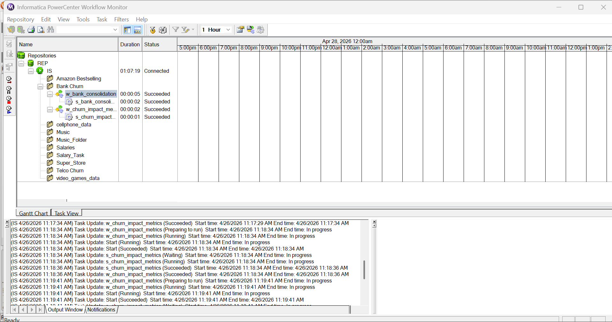

# 🏦 Bank Customer Churn: End-to-End Data Engineering Pipeline

<div align="center">


</div>

> **An enterprise-grade ETL (Extract, Transform, Load) pipeline built with Informatica PowerCenter and Oracle SQL. This project extracts, anonymizes, and routes European bank customer churn data into localized Data Marts and analytical dimension tables.**

---

## 📖 Table of Contents

| # | Section |
|---|---------|
| 1 | [Executive Summary](#-executive-summary) |
| 2 | [Business Problem & Objective](#-business-problem--objective) |
| 3 | [Technology Stack](#-technology-stack) |
| 4 | [Repository Structure](#-repository-structure) |
| 5 | [Prerequisites & Setup](#-prerequisites--setup) |
| 6 | [Pipeline Architecture & Detailed Execution](#-pipeline-architecture--detailed-execution) |
| 7 | [Database Schema (Oracle SQL)](#-database-schema-oracle-sql) |
| 8 | [Workflow Execution & Monitoring](#-workflow-execution--monitoring) |
| 9 | [Learning Outcomes & Competencies](#-learning-outcomes--competencies) |
| 10 | [Future Scope](#-future-scope) |

---

## 📌 Executive Summary

While traditional data projects often focus on predicting churn using Machine Learning, this repository highlights the critical **data architecture and pipeline engineering** required *before* data scientists can build their models.

Using **Informatica PowerCenter**, I engineered a multi-tier pipeline to ingest raw, fragmented European banking data, cleanse it, generate analytical metrics, and route it into highly structured operational data stores for localized downstream analytics.

---

## 🎯 Business Problem & Objective

**The Problem:** The bank is experiencing customer attrition (churn) across multiple European branches. The raw data is fragmented across active and exited customer databases, contains sensitive Personally Identifiable Information (PII), and lacks the structured metrics required by regional retention teams.

**The Solution:** Build an automated ETL pipeline that:

1. 🔗 Merges active and churned customer data into a unified staging layer
2. 🔒 Anonymizes the data for GDPR/regulatory compliance
3. 🌍 Routes data into region-specific tables (France, Germany, Spain) for local data governance
4. 🚨 Automatically flags high-value flight risks for immediate retention efforts

---

## 🛠️ Technology Stack

| Layer | Technology | Purpose |
|-------|-----------|---------|
| ETL Engine | Informatica PowerCenter 10.x | Pipeline orchestration & transformation |
| Database | Oracle Database 19c | Target schema & data persistence |
| IDE | Oracle SQL Developer | Schema management & query validation |
| Design | Informatica Designer | Mapping & transformation design |
| Orchestration | Workflow Manager / Monitor | Scheduling, execution & monitoring |

**Transformations Mastered:**

| Type | Transformations |
|------|----------------|
| ⚡ Active | Source Qualifier · Union · Router · Rank · Aggregator · Filter · Sorter |
| 🔵 Passive | Expression · Sequence Generator |

---

## 📂 Repository Structure

```text
bank-churn-etl-pipeline/
│
├── images/                           # Execution screenshots and workflow logs
│   ├── 1.png                         # Union & Cleansing Mapping
│   ├── 2.png                         # Regional Data Mart Output
│   ├── 3.png                         # Elite Credit Output
│   ├── 3.1.png                       # Elite Credit Extended Output
│   ├── 4.png                         # Flight Risk Output
│   ├── 5.png                         # Router Mapping
│   ├── 6.png                         # Rank Transformation Mapping
│   ├── 6.1.png                       # Rank Configuration
│   └── 7.png                         # Workflow Monitor Logs
│
├── sql/                              # Database definition scripts
│   └── bank_churn_schema.sql         # Source, Staging, and Target DDLs
│
├── data/                             # Raw datasets
│   └── Churn_Modelling.csv
│
└── README.md                         # Project documentation
```

---

## ⚙️ Prerequisites & Setup

To deploy and test this pipeline locally, ensure the following are configured:

- [ ] **Oracle SQL Developer** — configured with an active admin connection
- [ ] **Informatica PowerCenter Client** — Repository Manager, Designer, Workflow Manager installed
- [ ] Execute the DDL scripts in `sql/bank_churn_schema.sql` to generate the required source and target schemas
- [ ] Import `Churn_Modelling.csv` into the `Bank_Churn_Raw` source table

---

## 🏗️ Pipeline Architecture & Detailed Execution

The pipeline is structured into **four sequential phases**, each addressing a distinct business requirement.

```
Raw Data (Active + Exited)
        │
        ▼
┌──────────────────┐
│  Phase 1         │  → Union + Cleanse + Surrogate Key
│  Consolidation   │
└──────────────────┘
        │
        ▼
┌──────────────────┐
│  Phase 2         │  → Router → France / Germany / Spain Marts
│  Distribution    │
└──────────────────┘
        │
        ▼
┌──────────────────┐
│  Phase 3         │  → Filter → Rank → Top 10 Elite Credit Members
│  Elite Ranking   │
└──────────────────┘
        │
        ▼
┌──────────────────┐
│  Phase 4         │  → Filter → Sorter → High-Value Flight Risks
│  Risk Extraction │
└──────────────────┘
```

---

### Phase 1 — Split-Source Consolidation & Cleansing

| Attribute | Detail |
|-----------|--------|
| **Objective** | Merge fragmented data streams, strip PII, and generate surrogate keys |
| **Flow** | `Source Qualifier` ➔ `Union` ➔ `Sequence Generator` ➔ `Target` |

**Implementation Details:**
- Dual Source Qualifiers simulate reading from two distinct operational databases (Active vs. Exited Customers)
- A **Union Transformation** merges both streams vertically into a single unified pipeline
- The `Surname` column is dropped to enforce GDPR/PII compliance
- A **Sequence Generator** assigns a unique `seq_id` surrogate key (starting at 1000) to establish the staging layer primary key

<br>


> *Fig 1: The Informatica mapping (`m_bank_churn_clean`) — dual Source Qualifiers feeding into the Union Transformation, followed by PII stripping and surrogate key assignment.*

---

### Phase 2 — Multi-Regional Distribution (Data Marts)

| Attribute | Detail |
|-----------|--------|
| **Objective** | Distribute the unified data into localized, region-specific operational tables |
| **Flow** | `Source Qualifier` ➔ `Router` ➔ `Targets` |

**Implementation Details:**
- Regional data governance mandates that French, German, and Spanish customer data be **physically isolated**
- A **Router Transformation** acts as a traffic controller, evaluating the `Geography` column and actively splitting the single data stream into three distinct physical target tables

<br>


> *Fig 2: The Router transformation (`m_geo_router`) — actively splitting the data stream based on strict geographical filter conditions.*

<br>


> *Fig 3: Successfully populated Data Marts for French, German, and Spanish customers verified in Oracle SQL Developer.*

---

### Phase 3 — Elite Credit Member Ranking

| Attribute | Detail |
|-----------|--------|
| **Objective** | Identify top-tier active customers for premium banking product cross-selling |
| **Flow** | `Filter` ➔ `Rank` ➔ `Target` |

**Implementation Details:**
- A **Filter Transformation** strictly isolates actively engaged members (`IsActiveMember = 1`)
- A **Rank Transformation** (configured as a Top-N filter) dynamically identifies the **Top 10 customers** by `CreditScore`
- The engine handles index ranking automatically and passes the elite tier to the dimension table

<br>


> *Fig 4: The pipeline (`m_top_credit`) — Filter into Rank Transformation for Top 10 elite credit member extraction.*

<br>


> *Fig 5: Port setup and configuration properties for the Rank and Sorter — including Top-N parameter and sort key definition.*

<br>


> *Fig 6: The output dimension table capturing the Top 10 Elite Credit Members with their associated credit scores.*

<br>


> *Fig 7: Extended output verifying accurate rank index assignment applied across all customer records.*

---

### Phase 4 — High-Value Flight Risk Extraction

| Attribute | Detail |
|-----------|--------|
| **Objective** | Profile significant financial losses to trigger immediate retention alerts |
| **Flow** | `Filter` ➔ `Sorter` ➔ `Target` |

**Implementation Details:**
- A multi-condition **Filter Transformation** isolates severe flight risks:
  - `Exited = 1` (customer has already churned) **AND**
  - `Balance > 100,000` (high capital exposure)
- A **Sorter Transformation** orders records by `Balance DESC`, ensuring the largest financial impacts surface first in the report

<br>


> *Fig 8: The operational target table capturing sorted high-value churned accounts — ordered by descending balance for immediate retention prioritization.*

---

## 🗄️ Database Schema (Oracle SQL)

The schema is organized across three tiers:

```
Source Layer          Staging Layer           Target Layer
─────────────         ─────────────           ────────────
Bank_Churn_Raw   →    Unified_Staging    →    GEO_FRANCE
(Active)                                      GEO_GERMANY
Bank_Churn_Exited                             GEO_SPAIN
(Exited)                                      ELITE_CREDIT_MEMBERS
                                              FLIGHT_RISK_ACCOUNTS
```

> Full DDL available in [`sql/bank_churn_schema.sql`](sql/bank_churn_schema.sql)

---

## 📊 Workflow Execution & Monitoring

All sessions and tasks were orchestrated via **Informatica Workflow Manager** and monitored using **Workflow Monitor**.


> *Fig 9: Workflow Monitor logs showing successful execution of all sessions — zero error rows, all targets loaded.*

**Execution Summary:**

| Phase | Mapping | Status |
|-------|---------|--------|
| Consolidation & Cleansing | `m_bank_churn_clean` | ✅ Succeeded |
| Multi-Regional Distribution | `m_geo_router` | ✅ Succeeded |
| Elite Credit Ranking | `m_top_credit` | ✅ Succeeded |
| Flight Risk Extraction | `m_flight_risk` | ✅ Succeeded |

---

## 🎓 Learning Outcomes & Competencies

This project demonstrates practical proficiency in:

- **ETL Architecture Design** — multi-phase pipeline design with clearly defined staging and target layers
- **Informatica PowerCenter** — end-to-end use of Designer, Workflow Manager, and Workflow Monitor
- **Data Governance** — GDPR-compliant PII stripping and region-based data isolation
- **Transformation Mastery** — Union, Router, Rank, Filter, Sorter, Sequence Generator, Expression
- **Oracle SQL** — DDL scripting, schema management, and output validation

---

## 🚀 Future Scope

- [ ] Integrate a **real-time CDC (Change Data Capture)** layer using Informatica PowerExchange
- [ ] Add an **Aggregator-based** churn rate KPI calculation per region
- [ ] Expose target tables to a **Tableau dashboard** for executive retention reporting
- [ ] Implement **parameterized workflows** for configurable Top-N ranking and balance thresholds
- [ ] Add **error routing** with a dedicated rejected-records table and email alerting

---

<div align="center">

*Built with Informatica PowerCenter · Oracle Database 19c · SQL Developer*

</div>
